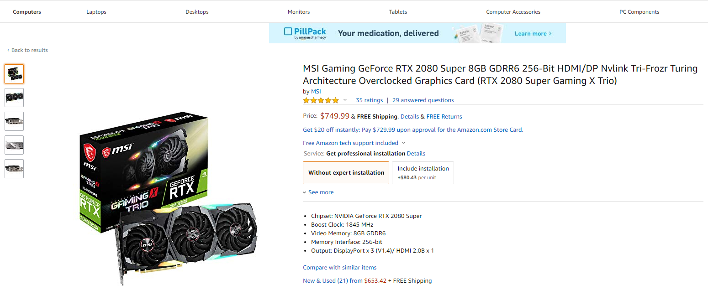

# AmazonPriceTracker

A Python script that checks the price of the item and notifies the user when the price is dropped.
Specifically in this program, I focused on GeForce RTX 2080 GPU from Amazon. 
The user is notified through e-mail and a link to the amazon product page in the message.

API's: requests, smtplib, BeautifulSoup

